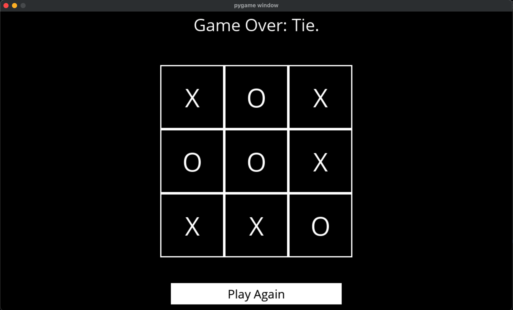

# 🎮 Tic-Tac-Toe AI



This project is focused on building an AI agent that plays Tic-Tac-Toe optimally using the **Minimax algorithm**.

---

## 📚 Table of Contents

- [🧠 Project Overview](#-project-overview)
- [🧠 How the AI Agent Works](#-how-the-ai-agent-works)
- [✨ Reasoning Architecture](#-reasoning-architecture)
- [🛠️ Features](#-features)
- [🧪 AI Concepts Applied](#-ai-concepts-applied)
- [📁 Project Structure](#-project-structure)
- [🚀 Getting Started](#-getting-started)

---

## 🧠 Project Overview

This AI is designed for a **deterministic**, **perfect-information**, **zero-sum** game environment — exactly the kind of scenario foundational to many classic AI problems.

> ⚠️ It will either win or draw — **never lose.**

This project puts into practice key AI principles that scale to more complex problems like:

- Chess and Go engines
- Real-time strategy AI
- Tactical planning agents
- Search-based decision systems

---

## 🧠 How the AI Agent Works

This project implements a **search-based AI reasoning agent** using the **Minimax algorithm**. The AI evaluates every possible future board state recursively, reasoning through the game tree to make an optimal decision at every turn.

Rather than using hardcoded rules or heuristics, this AI:
- Simulates future outcomes for each possible move
- Assigns utility values to terminal states (`1` win, `-1` loss, `0` draw)
- Propagates scores backward through the tree
- Chooses the move that maximizes or minimizes utility, depending on the current player

This structure reflects how early AI systems approached complex decision-making problems before learning-based systems became dominant.

### ✨ Reasoning Architecture

Internally, the Ai agent uses:
- A **public interface** (`minimax`) to return the optimal move
- A **private recursive engine** (`_minimax_internal`) that evaluates both score and action
- Separate functions for the **maximizing** and **minimizing** player decisions
- Pure functions (no mutation), ensuring every recursion is safe and predictable

This mirrors architectures used in:
- Turn-based tactical games
- Board game engines (chess, checkers)
- Symbolic planning systems
- Automated decision pipelines

> 🧠 The AI does not "react" — it **reasons**.

---

## 🛠️ Features

- ✅ Intelligent AI using Minimax
- ✅ Recursive evaluation of game trees
- ✅ Interactive gameplay via Pygame UI
- ✅ Core functions written from scratch

---

## 🧪 AI Concepts Applied

| Concept                  | Description                                                 |
|--------------------------|-------------------------------------------------------------|
| **Minimax Algorithm**    | Explores all possible game outcomes to minimize loss        |
| **Adversarial Search**   | Assumes opponent plays optimally                            |
| **Game Trees**           | Builds complete decision paths for each player              |
| **Utility Evaluation**   | Assigns numeric scores to terminal states                   |
| **Turn-Based Simulation**| Alternates player turns based on board state                |

---

## 📁 Project Structure

| File            | Description                                 |
|-----------------|---------------------------------------------|
| `agents/alpha_beta.py`  | AI agent that uses the Alpha-Beta Pruning strategy for optimal decision-making |
| `agents/minimax.py`  | AI agent that uses the Mimimax strategy for optimal decision-making |
| `utils/game_logic.py`  | Implements game rules and shared logic for the AI agent |
| `runner.py`     | Simple UI to play against the AI (via Pygame) |
| `requirements.txt` | Project dependencies (mainly `pygame`)   |

---

## 🚀 Getting Started

Follow these steps to set up and run the project on your local machine:

### 1. Clone the Repository

```bash
git clone https://github.com/RichardPinheiro/tic-tac-toe-AI.git
cd tic-tac-toe-ai
```

### 2. Create a Virtual Environment (Recommended)

```bash
python3 -m venv .venv
```

### 3. Activate the Virtual Environment

```bash
source .venv/bin/activate
```
On Windows, use:
```bash
.venv\Scripts\activate
```

### 4. Install Dependencies

```bash
pip install -r requirements.txt
```

### 5. Run the Game

```bash
python3 runner.py
```
